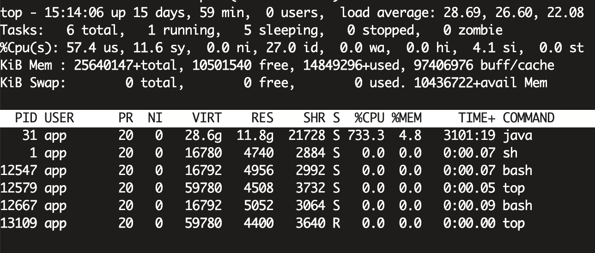
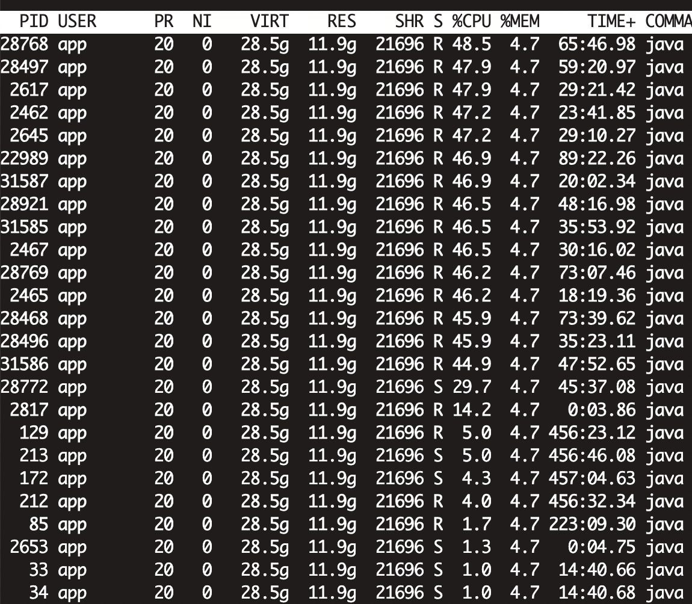
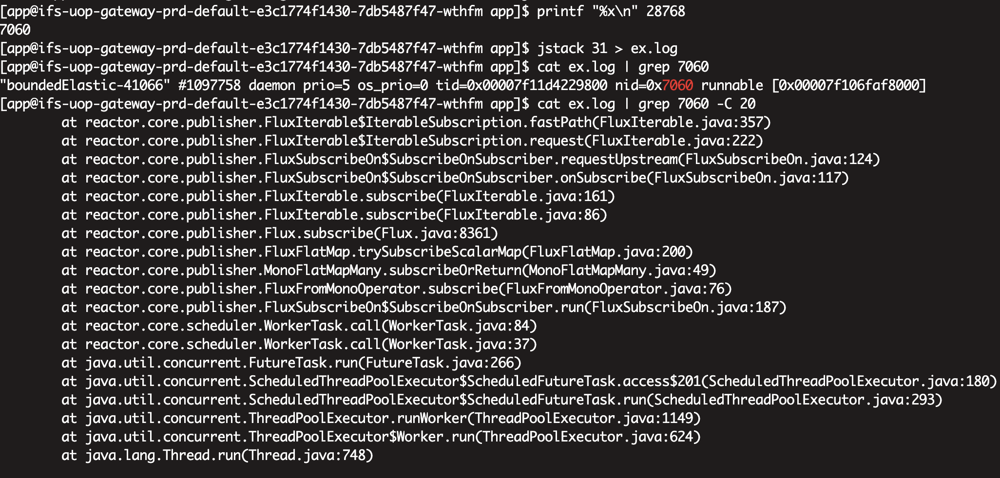

# 20240704

> 记一次线上环境CPU资源耗尽排查过程

1. 查看进程使用

```shell
top
```

2. 查看线程使用得到资源使用大的线程id

```shell
top -Hp [pid] 
```

3. 转换线程id为16进制

```shell
printf "%x\n" [线程id] 
```

4.  将java进程堆栈输出到文件

```shell
jstack [pid] > ex.log
```

5.  通过线程ID定位到堆栈内容

```shell
cat ex.log | grep [16进制线程id] -C 20
```


操作过程截图：

查看进程ID可以看出进程ID=31的进程使用CPU资源高



查看进程中的线程可以看到前面几个都使用了较高的CPU



输出进程的堆栈日志，使用16进制线程ID检索内容

