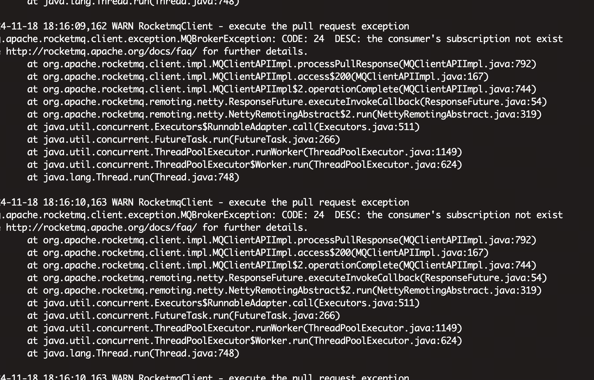
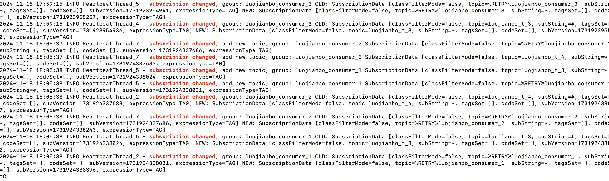
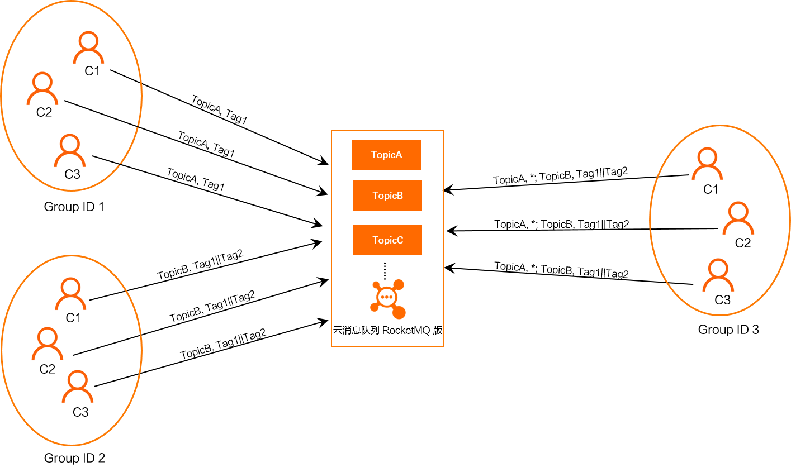
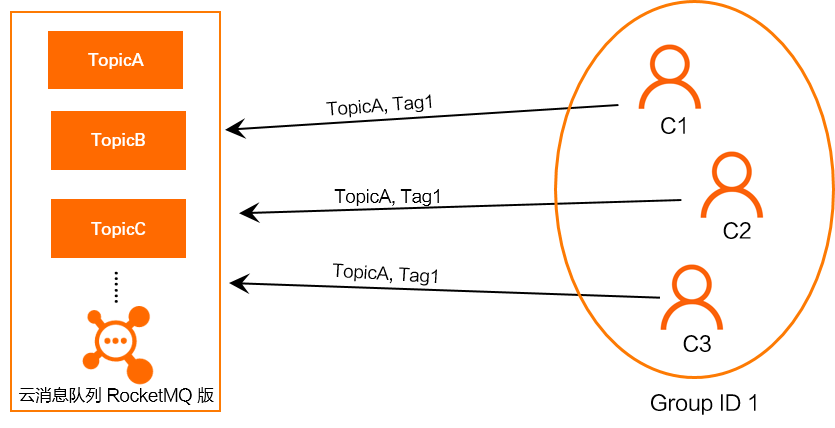
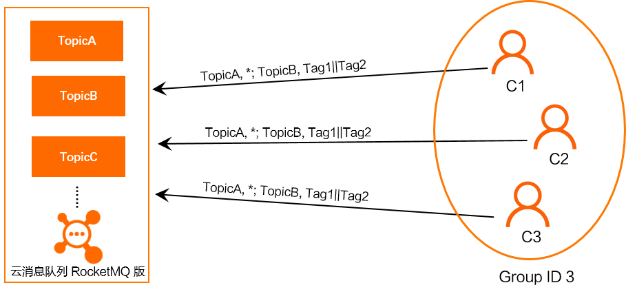

# 20241118

记一次RocketMQ4.9消费组订阅问题。

## 问题描述

一个消费组订阅多个topic出现了消息阻塞问题，直接现象就是topic消息不消费。

## 排查过程

1. 查看RocketMQ客户端日志发现许多拉取消息异常**the consumer's subscription not exist**

2. 查看broker日志发现许多**subscription changed**。

## 源码追踪

1. the consumer's subscription not exist表示订阅关系不存在，subscription changed表示消费组订阅关系一直在不停的变化。正常情况这两个都不应该出现。
2. 查看相关源码后发现是每次发送心跳不一致导致的消费订阅关系变化，RocketMQ客户端发送给Broker的心跳中包含客户端消费组的订阅关系，但是一个消费组订阅多个topic后发送的心跳没有保持一致，例如第一次发生的心跳是groupA订阅topicA，第二次发生的心跳就变成了groupA订阅topicB。实际上在客户端groupA同时订阅了topicA、topicB。心跳不一致就导致Broker收到的订阅关系不一致，会不停的更新订阅关系。客户端就会出现订阅关系不存在的异常（因为被另一个订阅关系覆盖了）。

## 原理阐述

订阅关系一致指的是同一个消费者分组Group ID下，所有Consumer实例所订阅的Topic和Tag必须完全一致。如果订阅关系不一致，可能导致消息消费逻辑混乱，消息被重复消费或遗漏。

---

## 1.什么是订阅关系一致？
云消息队列 RocketMQ 版里的一个消费者分组Group ID代表一个Consumer实例群组。对于大多数分布式应用来说，一个Group ID下通常会挂载多个Consumer实例。

云消息队列 RocketMQ 版的订阅关系指的是指定某个消费者分组Group ID对于某个主题Topic的订阅，包括订阅Topic时的过滤条件。

因此，订阅关系一致性的范围是同一Group ID下所有消费者对于指定Topic的订阅都相同。其中包括：

### 订阅的Topic必须一致。

例如：Consumer1订阅TopicA和TopicB，Consumer2也必须订阅TopicA和TopicB，不能只订阅TopicA、只订阅TopicB或订阅TopicA和TopicC。

订阅的同一个Topic中的Tag必须一致，包括Tag的数量和Tag的顺序。

例如：Consumer1订阅TopicB且Tag为Tag1||Tag2，Consumer2订阅TopicB的Tag也必须是Tag1||Tag2，不能只订阅Tag1、只订阅Tag2或者订阅Tag2||Tag1。

### 订阅多个Topic时Topic的类型一致。

例如，Consumer1和Consumer2都同时订阅TopicA和TopicB，则这两个Topic的类型必须一致，必须都是普通消息或者都是顺序消息。

正确的订阅关系如下，多个Group ID分别订阅了不同的Topic，但是同一个Group ID下的多个Consumer实例C1、C2、C3订阅的Topic和Tag都一致。正确订阅关系

> 重要: RocketMQ持使用TCP协议和HTTP协议的SDK客户端收发消息，除了保证同一Group ID下的Consumer实例订阅关系一致，还必须保证订阅消息的Group ID的协议版本和SDK的协议版本一致，例如，使用TCP协议的SDK收发消息，订阅消息时也必须使用创建的TCP协议的Group ID，否则会导致消息消费失败。

### 正确订阅关系一：订阅一个Topic且订阅一个Tag
如下图所示，同一Group ID下的三个Consumer实例C1、C2和C3分别都订阅了TopicA，且订阅TopicA的Tag也都是Tag1，符合订阅关系一致原则。

  
### 正确订阅关系二：订阅一个Topic且订阅多个Tag
如下图所示，同一Group ID下的三个Consumer实例C1、C2和C3分别都订阅了TopicB，订阅TopicB的Tag也都是Tag1和Tag2，表示订阅TopicB中所有Tag为Tag1或Tag2的消息，且顺序一致都是Tag1||Tag2，符合订阅关系一致性原则。

 
### 正确订阅关系三：订阅多个Topic且订阅多个Tag
如下图所示，同一Group ID下的三个Consumer实例C1、C2和C3分别都订阅了TopicA和TopicB，且订阅的TopicA都未指定Tag，即订阅TopicA中的所有消息，订阅的TopicB的Tag都是Tag1和Tag2，表示订阅TopicB中所有Tag为Tag1或Tag2的消息，且顺序一致都是Tag1||Tag2，符合订阅关系一致原则。

               
### 常见订阅关系不一致场景
收发消息时，Consumer收到的消息不符合预期并且订阅关系不一致，则Consumer实例可能存在以下问题：

### 错误示例一：同一Group ID下的Consumer实例订阅的Topic不同
如下图所示，同一Group ID下的三个Consumer实例C1、C2和C3分别订阅了TopicA、TopicB和TopicC，订阅的Topic不一致，不符合订阅关系一致性原则。

### 错误示例二：同一Group ID下的Consumer实例订阅的Topic相同，但订阅Topic的Tag不同
如下图所示，同一Group ID下的三个Consumer实例C1、C2和C3分别都订阅了TopicA，但是C1订阅TopicA的Tag为Tag1，C2和C3订阅的TopicA的Tag为Tag2，订阅同一Topic的Tag不一致，不符合订阅关系一致性原则。

### 错误示例三：同一Group ID下的Consumer实例订阅的Topic及Topic的Tag都相同，但订阅的Tag顺序不同
如下图所示，同一Group ID下的三个Consumer实例C1、C2和C3分别都订阅了TopicA和TopicB，并且订阅的TopicA都没有指定Tag，订阅TopicB的Tag都是Tag1和Tag2，但是C1订阅TopicB的Tag为Tag1||Tag2，C2和C3订阅的Tag为Tag2||Tag1，顺序不一致，不符合订阅关系一致性原则。

### 订阅关系常见问题
一个Group ID是否可以和多个Topic存在订阅关系？
支持，一个Group可以订阅多个Topic，该Group对于指定一个Topic的订阅算1个订阅关系，您需要确保每一个订阅关系中，Group下所有Consumer对于指定Topic的订阅都一致。

### 订阅关系是否支持手动删除？
订阅关系需要在消费者客户端代码中设置。

## 解决方案

一个消费组订阅一个topic

