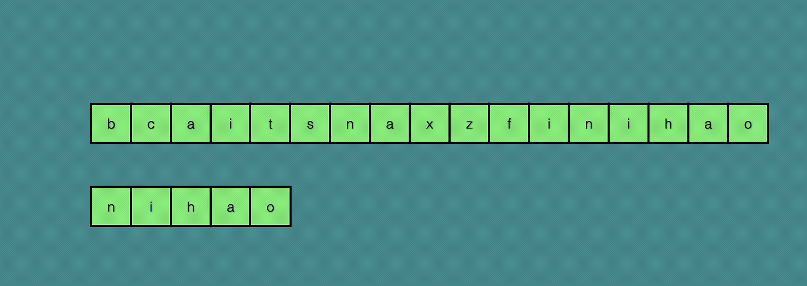

# 20250116

>  字符串查找算法之**sunday**算法

Java中的字符串indexOf()方法使用的暴力搜索算法，面对最好和最坏情况性能一致。但是会遇到重复匹配的情况，这些情况是可以避免的。sunday算法就可以根据字符串的特性避免重复比较提升性能。

1. sunday算法

Sunday算法是Daniel M.Sunday于1990年提出的字符串模式匹配算法，它比KMP算法和BM算法都要晚提出。不过其逻辑和处理方式比后二者要更简单清晰。Sunday算法会提前记录  的组成和每种字符在  中最右出现的位置，比如  : "abcab"，每种字符在模板中的最靠右的位置为{'a':3, 'b':4, 'c':2}。

字符串：    'A' B C D E F G H X Y Z

子字符串：'F' G

从头开始'A'与'F'不匹配，看最后一位'C'在子串中不存在，字符串匹配指针后移3位子串的'F'对齐'D'，从'D'开始匹配。

- A B C 'D' E F G H X Y Z

- ​       'F' G

从匹配指针开始'D'与'F'不匹配，看最后一位'E'在子串中不存在，字符串匹配指针后移2位子串的'F'对齐'F'，从'F'开始匹配。

- A B C D E 'FG' H X Y Z

- ​                 'FG'

从匹配指针开始逐个匹配'FG'，完全匹配。



1. 代码实现

```java
public static int myIndexOf(String temp, String title) {
        HashMap<Character, Integer> map = new HashMap<>();
        char[] titleChars = title.toCharArray();
        for (int i = 0; i < titleChars.length; i++) {
            map.put(titleChars[i], i);
        }
        char[] tempChars = temp.toCharArray();
        int i = -1; // temp index
        int n = -1; // title index
        int titleLen = titleChars.length;
        int temLen = tempChars.length;
        while (true) {
            while (++n < titleLen && ++i < temLen && tempChars[i] == titleChars[n]) ;
            if (n == titleLen) {
                return i - titleLen + 1;
            }
            i = i + (titleLen - n);
            if (i >= temLen) {
                return -1;
            }
            Integer index = map.get(tempChars[i]);
            if (Objects.nonNull(index)) {
                i -= index;
            } else {
                i++;
            }
            if (temLen - i < titleLen) {
                return -1;
            }
            n = 0;
        }
    }
```

